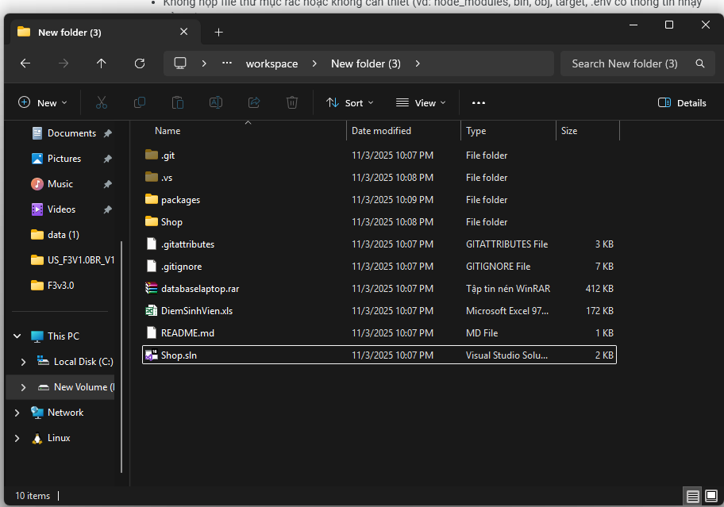
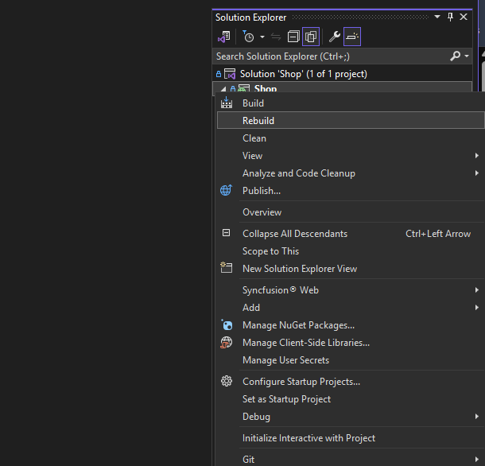
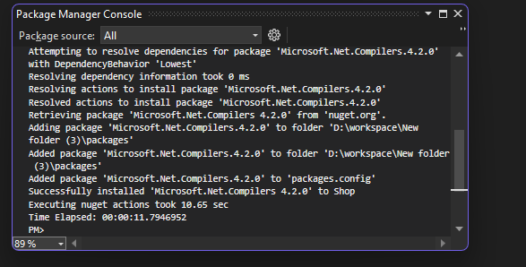
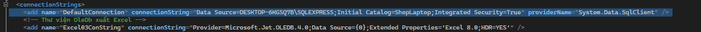
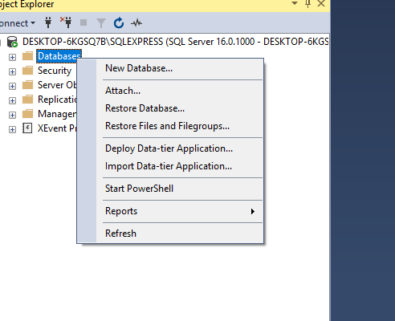
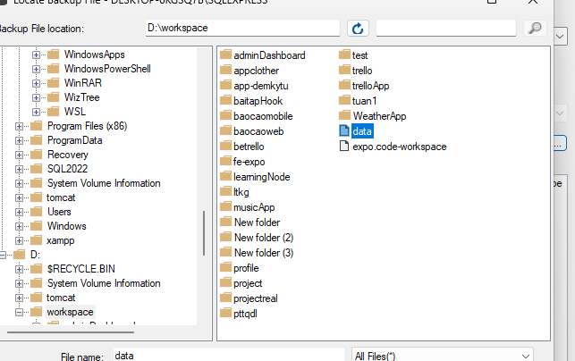
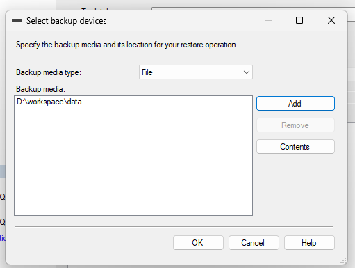
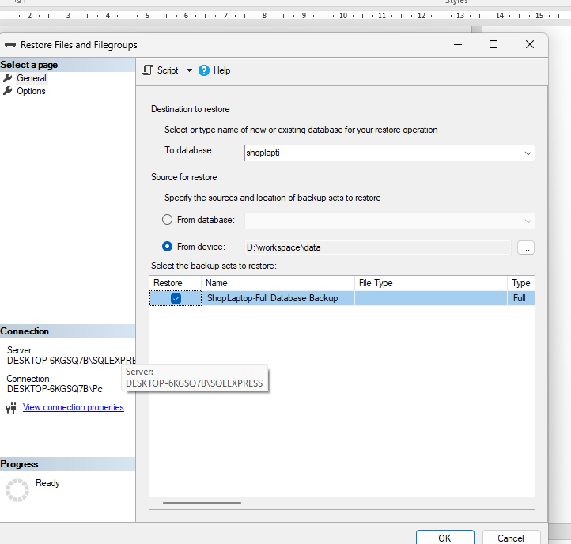
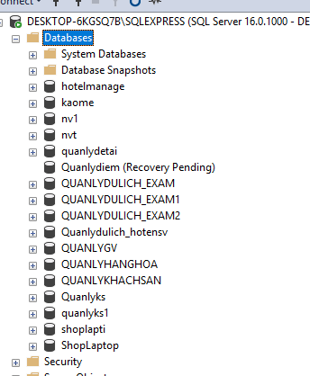

# Shop

Shop Laptop, Phone, Watch, PC, Tablet ASP.NET MVC5

# Công nghệ sử dụng

Bootstrap/Jquery
ASP.NETMVC5/EF6/SQLServer

# Ảnh sản phẩm

# Database

# Hỗ trợ thành toán Online

Hướng dẫn

Bước 1: Sau khi clone dự án về thì mở dự án qua file Shop.sln bằng visual studio code

Bước 2: Sau khi vào dự án chuột phải vào dự án và ấn reBuild như trong ảnh

Bước 3: Vào tìm kiếm và tìm Package Manager Console

Bước 4
• Chạy lệnh: Install-Package Microsoft.CodeDom.Providers.DotNetCompilerPlatform Sau đó chạy tiếp: Install-Package Microsoft.Net.Compilers rồi thực hiện lại bước 2

Bước 5: Chỉ thực hiện sau khi backup database truy cập vào file Web.config Tìm dòng như ảnh rồi sửa tên cổng kết nối

Restore Database
Bước 1 chọn restore files ….

Bước 2: tìm đến nơi vừa tải file về rồi add file đấy

Bước 4 click chonj mục đầu để restore như trong ảnh -> Ấn ok

